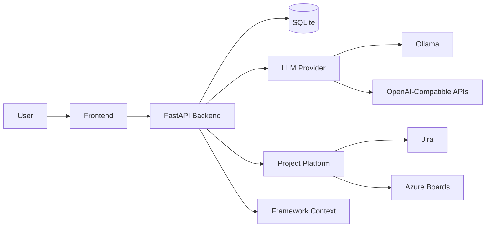
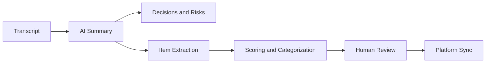
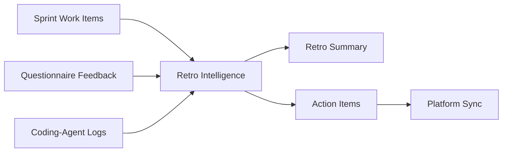

# The RP

**The RP** is an AI-assisted workflow tool that helps software teams move from planning conversations to structured backlog work and from sprint outcomes to actionable retrospective improvements.

It combines:

- transcript-driven planning support
- AI-generated backlog extraction and scoring
- Jira and Azure Boards integration
- sprint retrospective synthesis
- optional company framework alignment
- configurable LLM providers, including local and hosted models

---

## What The RP Does

The RP supports two main workflow loops.

### 1. Planning Backlog Intelligence

Users can paste a planning transcript and let the system:

- summarize the meeting
- extract key decisions and risks
- generate candidate backlog items
- propose acceptance criteria
- score work with story points and priority
- categorize work into stories, features, and tasks
- allow review and approval before sync
- sync approved items to Jira or Azure Boards

### 2. Sprint Retro Intelligence

Users can select a sprint and combine:

- sprint work item data
- retro questionnaire feedback
- sentiment score
- optional coding-agent session logs

The system then generates:

- a sprint summary
- what went well
- what did not go well
- average team sentiment
- proposed follow-up action items

Those action items can also be synced back to the selected work platform.

---

## Why It Matters

Software teams often lose time in three places:

- manually rewriting meetings into backlog tickets
- maintaining consistent backlog quality
- turning retrospective feedback into real follow-up work

The RP reduces that friction by using AI to create structured outputs from natural team inputs while keeping humans in control of final review and approval.

---

## Core Features

- Planning transcript ingestion
- Meeting summary, decision, and risk extraction
- Candidate backlog item generation
- Story point and priority scoring
- Human review and approval workflow
- Sync to Jira or Azure Boards
- Optional sync without sprint assignment
- Sprint retro questionnaire capture
- AI-generated retrospective reports
- Retro action item generation
- Sync retro actions back to platform
- Settings-driven runtime configuration
- Ollama and OpenAI-compatible LLM support
- Optional framework upload for company-specific policy alignment

---

## Architecture Overview

The RP currently uses:

- **Frontend**: React + TypeScript
- **Backend**: FastAPI
- **Persistence**: SQLite with SQLAlchemy
- **AI Layer**: Ollama or OpenAI-compatible APIs
- **Integrations**: Jira and Azure Boards

### High-Level Flow



### Planning Flow



### Retro Flow



---

## How Codex Was Used

This project explicitly uses **Codex** as part of the development process.

Codex was used to help:

- scaffold backend and frontend implementation
- accelerate iteration on FastAPI routes and React UI flows
- refactor integration paths and naming cleanup
- improve type handling, defensive UI behavior, and error handling
- support cleanup passes across planning, retro, settings, and integration workflows

In practical terms, Codex acted as a development accelerator and implementation partner during the build of The RP.

---

## How GPT-5.6 Was Used

This project explicitly uses **GPT-5.6** as the primary reasoning and transformation layer behind the product experience.

GPT-5.6 was used to power:

- transcript summarization
- decision and risk extraction
- backlog item generation
- backlog scoring and categorization
- framework-aware alignment to company policy
- retrospective synthesis from sprint data and feedback
- generation of follow-up improvement actions

In other words:

- **Codex helped build the product**
- **GPT-5.6 helps the product think**

This distinction is important and should be highlighted in demos, judging materials, and submission documents.

---

## Optional Framework Context

The RP supports an optional uploaded framework file that can contain:

- internal delivery standards
- mandated categorization logic
- company policy guidance
- story scoring rules
- writing conventions

This content is compressed for storage and then reused by the AI layer so outputs can align better with enterprise-specific expectations rather than generic defaults.

---

## Integrations

### Jira

The RP can:

- read available sprints
- create backlog items
- optionally assign items to a sprint
- create retro action items

### Azure Boards

The RP can:

- read iterations and sprint work items
- create features, stories, and tasks
- assign items to iteration paths
- push retro improvement actions back into the platform

---

## Running The App

### Backend

From:

`c:\Users\maila\Videos\RP\backend`

Run:

```powershell
python main.py
```

### Frontend

From:

`c:\Users\maila\Videos\RP\frontend`

Run:

```powershell
npm run dev
```

### Default Local URLs

- Backend: `http://127.0.0.1:8000`
- Frontend: Vite default, usually `http://localhost:5173`

---

## Installing Dependencies

### Backend

```powershell
cd c:\Users\maila\Videos\RP\backend
pip install -r requirements.txt
```

### Frontend

```powershell
cd c:\Users\maila\Videos\RP\frontend
npm install
```

---

## Current Positioning

The RP should be understood as:

- a workflow intelligence layer for software teams
- a practical AI delivery assistant, not just a chatbot
- a product that combines planning intelligence, integration, and continuous improvement

It is especially relevant to:

- product managers
- engineering managers
- scrum masters
- technical leads
- developers
- delivery excellence teams

---

## Future Roadmap

### Near Term

- stronger project mapping for Jira and Azure
- richer admin diagnostics
- reporting and exports
- improved multi-team workflow support

### Mid Term

- cross-sprint analytics
- backlog quality trend scoring
- framework conflict detection
- more advanced platform intelligence

### Long Term

- a **terminal-first CLI** for developers who prefer command-line workflows
- markdown-first and JSON-first outputs
- local shell integration
- IDE/editor extensions
- broader enterprise workflow integrations

Example future CLI direction:

```bash
the-rp plan analyze --file planning.txt --platform jira --project SCRUM
the-rp retro summarize --sprint 2 --include-agent-logs logs.md
the-rp framework upload --file company-framework.md
```

## Summary

**The RP** helps software teams capture intent, structure delivery work, and improve sprint outcomes through AI-assisted planning, platform integration, and retrospective intelligence.
